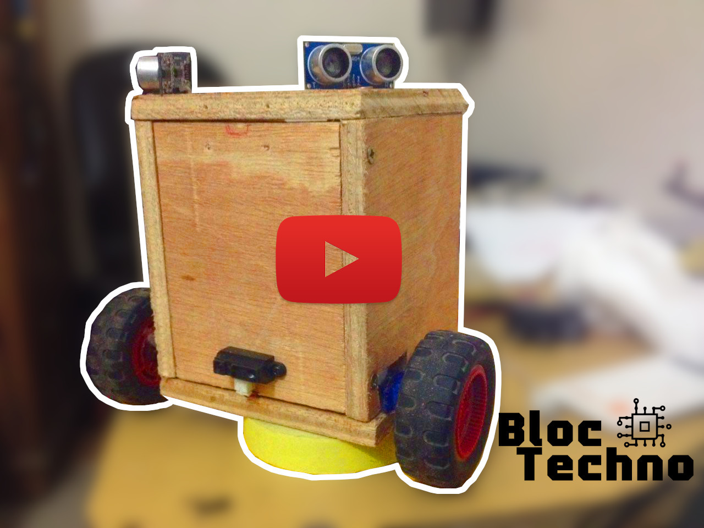

# __Pi-bot__ _v1.1_

 
Pi-bot est un robot autonome DIY(do it yourself) il a la capacité de ce déplacer en ligne droite et d'éviter les obstacles qui sont devant lui. Pour le moment il ne sait que faire ça, mais des améliorations sont prévu dans le futur pour le rendre utilise et plus intelligent

il utilise la carte arduino et est Opensource

### 3d desing with tinkercad.com [link pi_bot]( https://www.tinkercad.com/things/idVPFBBOuo1 )

## Schéma électrique

### capteurs et actionneurs
__ cabler le schéma électrique__

* 2 capteur ultrasound "hc-sr04"
* 1 capteur de distance "GP2Y0A41SK0F"
* 2 moteur dc ou 2 servomoteur
* 1 driver moteur l293d
* batterie 4,8v ou (powerbank)
* Arduino nano 
* pcb ou bread board

## code arduino 
__Téléverser le code sur votre arduino__

